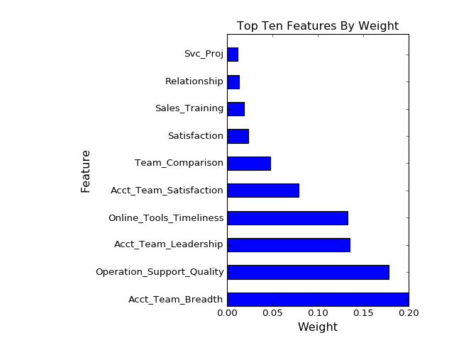
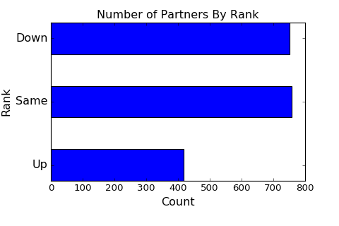
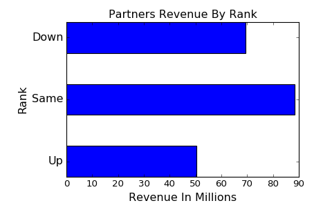

Forecasting Sales In Multi Tier Distribution Systems
Summary:  This python code forecasts sales and partner performance in a multi tier distribution channel.  This current development completes the sparse data matrices using pylibfm, a matrix factorization library, identifies the important categorical data,e.g., level of training, in estimating sales, and random forests for the final estimation of sales by quarter.  The final stage achieved a remarkable 90% p value on the test data.

Next Development:  The next model to be added is the switchpoint time series analysis using PYMC.  The probabilistic model will be applied to the revenue history for each partner demonstrating high or low performance in the predicted quarter.

Visualization:  Bokeh will be used to provide visualization in the next round of development.  Flask will be used to create an html presentation.  The interactive properties of Bokeh plus the open source availability is compelling if as claimed.  Bokeh builds an html interactive interface to the python programs.  

***THE BOKEH INTERFACE HAS BEEN COMPLETED FOR A DATA SLICE EQUAL TO THE TOP TWENTY AND BOTTOM TWENTY PREDICTED CHANGE.  THE DATA SLICE CAN BE MADE ON VIRTUALLY ANY FEATURE.  TO OBSERVE THE BOKEH VISUALIZATION CLONE THE GITHUB REPOSITORY, NAVIGATE THE TERMINAL TO THE CLONED REPOSITORY, OPEN A BROWSER, AND ENTER 'BOKEH SERVE  --SHOW BOKEH_UP.PY' AND 'BOKEH SERVE --SHOW BOKEH_DOWN.PY'.  THE VISUALIZATION IS INTERACTIVE AND WILL APPEAR AS TWO TABS IN YOUR BROWSER.***

Intent:  This description demonstrates the effectiveness of the ensemble predicting sales by individual partner but does not intend to show the range of conclusions that are surfaced by the analysis.  For example, the causes of each partners performance is not displayed in this abbreviated description.  

Program:  Assuming all dependencies have been loaded,e.g., pylibfm, the primary program is gazelle.py.  Open ipython and enter 'run gazelle.py'.  The charts require manual intervention.  This program still requires further streamlining.  The program data.py is a file of useful data tools and scratch.py is just a space for scripting out solution prototypes.  The primary source data is Partners_Data, df11, df12, df13, df14 and df2.

Sample:  The data has been derived from multiple sources and randomized.  It follows the essential structure of partner management data using historical sales, categorical events, vendor ratings, and dealer opinions of the vendor capabilities.  The data itself is a mixture of continuous, ordinal, and categorical data.  Manipulating the data is still a manual exercise.  Many functions for manipulating the data are included in the data.py script library.

Ordinal Data:  The ordinal data results from rankings made by both the vendor and the partner network.  This data is typically very sparse and in this case is composed of nearly 58% empty data cells.  The matrix factorization library is effective given the high accuracy of the final analytical stage.  The train/test split recorded a p value of .825 and an RMSE of .59.  The typical ordinal analytics using a sparse data fill with means computes to an RMSE of 1.2 on the 0 to 5 Likert scale responses.  The RMSE is roughly halved using the matrix factorization routine.  NOTE:  This is randomized data which implies real data may have a different 'fit'.  

Ordinal Data Queries Examples:

Loyalty:  A computed estimate of 'loyalty'.  
Satisfaction:  Partner general satisfaction rating.  
Value:  Partner estimate of the vendors value.  
Ease:  Ease in dealing effectively.  
Relationship:  Measures perception of mutual commitment.  
Profit:  Measures profitability as a driving fact.    
Communications:  Effectiveness of vendor communications.  
Product_Quality:  Products relative quality.  
Support_Quality:  Service relative quality.  
Partnership_Commit:  Partners perceived commitment strength.  
Support_Importance:  Partners need for support.  
Will_Recommend:  Will recommend to other partners.  
Continue:  Expectation of continuing partner relationship.  
Sales_Expectation:  Expection of critical sales in next quarter.  
Competitor_Comparison:  Relative position compared to competitors.  
Acct_Mgr_Quality: Quality measurement of vendor representative.   
Support_Mgr_Quality:  Quality measurement of support management.  
Account Team_Comparison:  Competitive comparison of total account team.  
Acct_Team_Ability:  Rated account team ability and proficiency.  
Acct_Team_Leadership:  Leadership ranking.  
Acct_Team_Breadth:  Ranking of account team support capabilities.

These example queries have been abstracted/condensed to general categories but the intent of the query is easily interpreted.

Categorical Data:  Categorical data is separated from the other types and analyzed through a decision tree regressor after dummies are rendered.  After several iterations reducing the variables it was found that in this data the categorical information had little effect on the revenue prediction.  A p value of .15 resulted.  However, the technique is still in the ensemble string for future data set analytics.
	
Categorical Data Examples

IDX:  A unique index of all entries.  
NID: A unique partner identifier.  
Year:  Data year.  
Qtr:  Data quarter in year.  
Region:	Major region or continent (often plural for an NID).  
Country:Country of operation (often plural for an NID)
RTM:Route to market (e.g., VAR).  
Certification:Vendor awarded certification.  
Credit_Score:Vendor awarded credit limit.  
Function:Occupation of reviewer, e.g., executive.  
Customer_Size:Typical customer size by employees.  
Customer_Segment:Typical customer, eg. GOVT, ENT.  

Continuous Data:  The y dependent is the continuous variable revenue. Independent features are price discount and average invoice value.  Any number of additional features could be added.

Stages:  The first two stages are the recommender for the sparse data replacement and the decision tree for the categorical data.  The pylibfm recommender is used due to its open source availability.  The decision tree is used because of its ability to process large data sets of vectorized categories.i.e, 'dummies'.  After distilling the data by the above steps the random forest regressor was applied across the 5 quarters of data.  Random forests was chosen due to its robust method coping with seemingly disparate data.  

Results:  
THE RFC METRICS ARE:  
AN RMSE OF 52.2940999046 (COMPARED TO RANGE OF 90,000 TO 135,000)
P VALUE ON THE TRAINING SET OF .985 AND P VALUE ON THE TEST SET OF .90.  

This is a remarkable result.  Forecasts by individual partner are rarely even close to this result.  The p value on the combined forecasts for total revenue is over .98 (although it is a very small sample set of 5 quarters.)

Further Analysis: 

The program development is not yet ready to analyze key factors for individual partners.  The results can identify class performance between those expected to out perform historical trends and those expected to underperform historical trends.  The program is able to identify the unique ID of each partner in the classes.

The tabulation showed that partners who are predicted to outperform historical norms contributed $50M in revenue while under performers contributed revenue of $69M.  Finding the cause of under performing partners would have a $6M to $7M positive impact on total revenue.  The predicted high performers are potentially adding $5M the total revenue or $5M increase.  At risk is the sum of $12M that could be added to total revenue.  Historically these two have offset each other and been invisible until after the quarterly revenue is recorded.  

				Rank		Player		Revenue
				Up			414			50,444
				Same		768			88,314
				Down		744			69,422

The causes of revenue are demonstrated in the analysis of features.	 These top ten features are the key drivers for performance.
	

The relative contribution by class from the above table is demonstrated:

